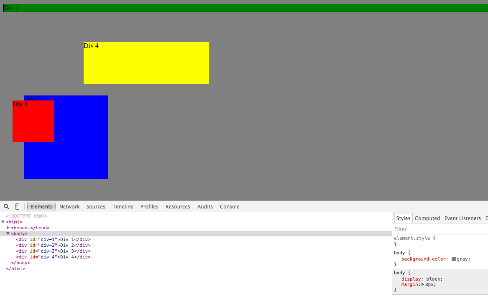
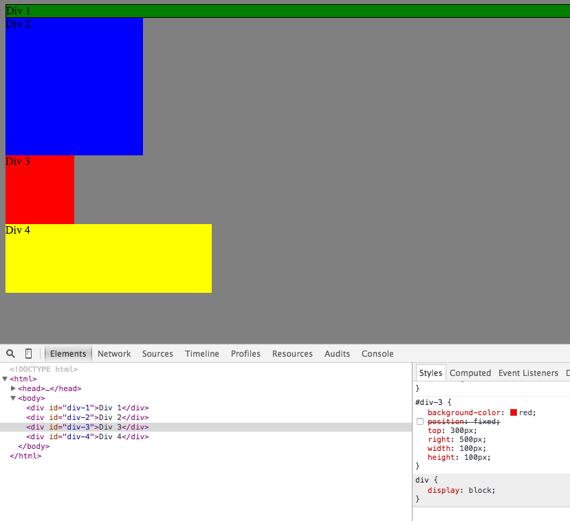
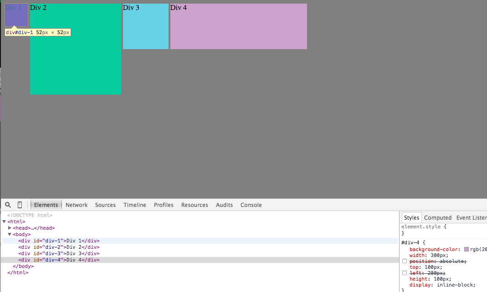
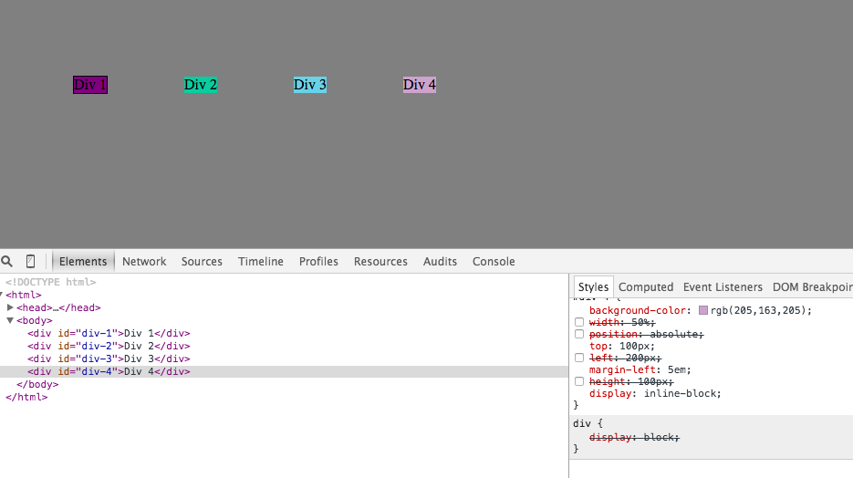
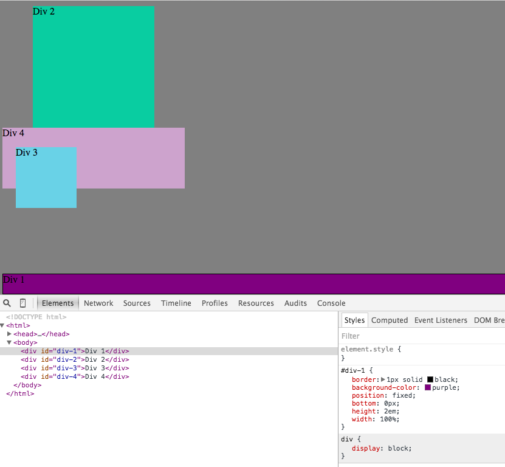
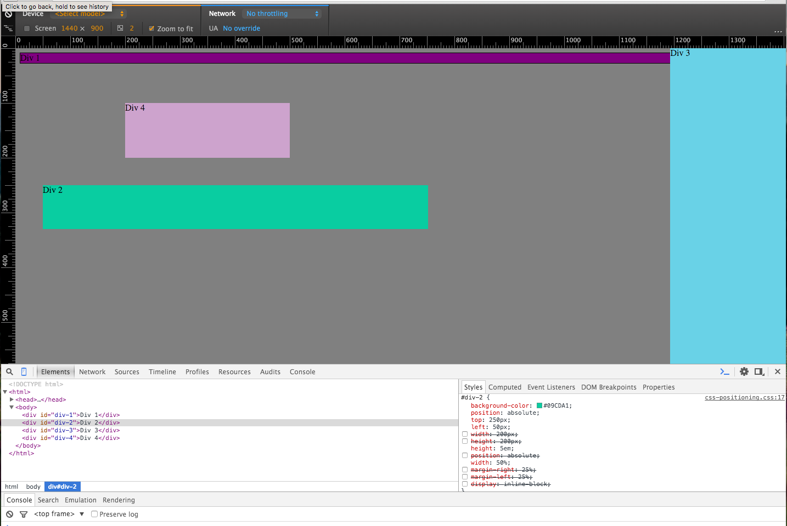

##3.4.1

##How can you use Chrome's DevTools inspector to help you format or position elements?
You can basically click into any element in the DOM and both view all of the CSS styles that are being applied, as well as edit them directly to  adjust any of the formatting or positioning. It immediately shows you the changes, so is far better for experimentation that making changes in sublime, saving and refreshing your browser.
##How can you resize elements on the DOM using CSS?
You can simply adjust the heighth and width by clicking into the properties and changing the associated values. Consider using % or em's to change them to values which will be responsive to screen size.
#What are the differences between Absolute, Fixed, Static, and Relative positioning? Which did you find easiest to use? Which was most difficult?
Static - this is the default positioning. It basically lays out elements as they appear top to bottom and left to right as they're read in the HTML and interpretted in the DOM. If values are set for any of the core cardinal directions (top, bottom, right, left), they will be ignored when position is set to static.
Relative - the relative positioning allows you to set a distance in the four cardinal directions that you want to shift youre element's position. If they are all set to zero, then the position will be immediately next to the previous object in the DOM (below if a block elemnt, next to it if an in-line element). If a position of left: 50px is set, then the object will move 50px away (to the right, visually) from the previous objects' normal position. Note that if the previous object was already shifted and also had relative position, then this does not change the current object's positioning. The normal position is what would have been applied based on simply reading the DOM top to bottom.
Absolute - the absolute positioning allows you to set a distance in each of the four directions from the top left of the page, regardless of any other elements and their positions. Therefore, setting position of left:100px and top:50px will move the element 100px from the left and 50px from the top, no matter what other elements are in its way.
Fixed - this is very similar to the absolute positioning, in that the dimensions are read from the top of left of the page regardless of other elements. However, this fixed is even more "restrictive" in the sense that the positioning is anchored to the viewport of the user's browser and will not change even when a user scrolls. So if you set a width of 100% and set the position to fixed with top:0px, then it will remain at the top of the screenview no matter how far down a user scrolls. Therefore, fixed can be useful as a header that you want to "float" at the top of the page as a users scrolls down.
##What are the differences between Margin, Border, and Padding?
Padding - padding is the innermoste attribute surrounding an element. It definese the amount of space between the content of an element and the border. For example, if there is text in an element, then the padding will be the amount of space between the text-lines and the border.
Border - The border is where you can define a solid or dotted lined border to give visual gridlines to the edges of your element.
Margin - The margin is the outermost attribute surrounding the element, and basically is used to create buffer between the border of your element and the other nearby elements. Margin and padding are very similar, and can be somewhat interchangeable so long as you are using invisible borders.
##What was your impression of this challenge overall? (love, hate, and why?)
Overall I thought it was a fun challenge. Definitely reinforced that learning CSS is all about trial and error, but it was way faster experimenting with things using DevTools than just with Sublime, which I'd been doing previously.